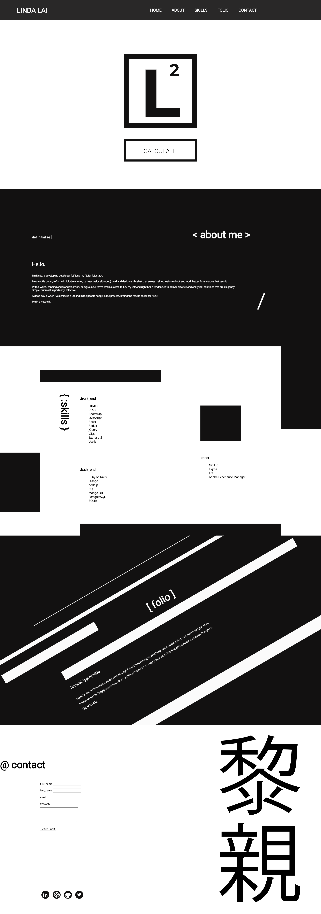
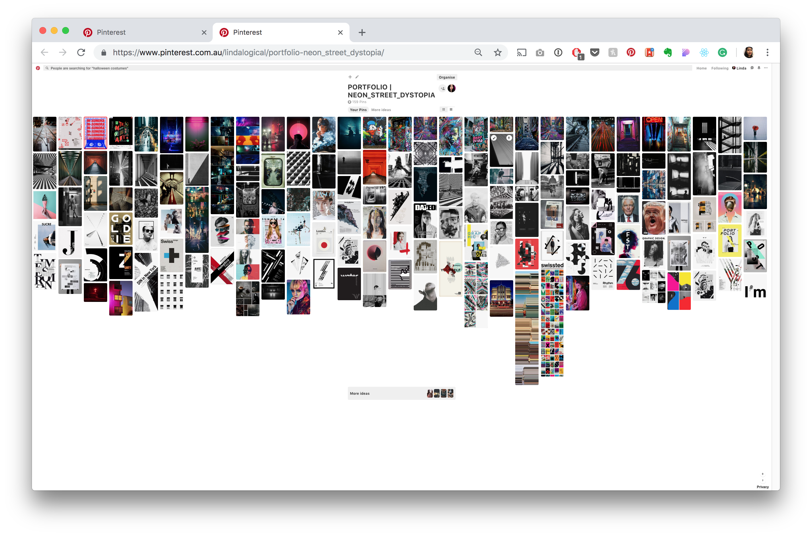
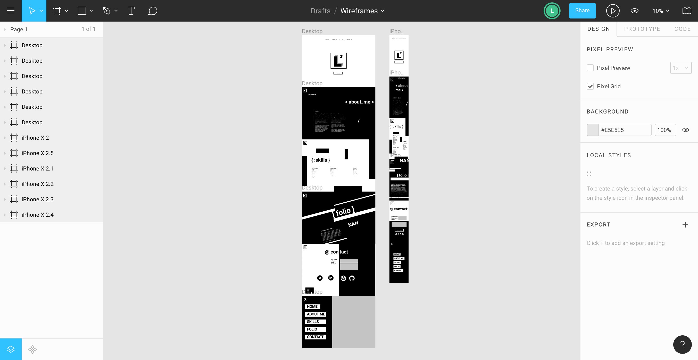

# Coding Portfolio: Linda Lai
My first developer portfolio written in HTML & CSS.

| |
|-----------|
| Linda Lai |

## Links
* URL: https://www.linda-lai.com/
* GitHub: https://github.com/linda-lai/linda-lai.github.io
* Figma: https://www.figma.com/file/WYyBs8vJ01FDA6ublEDyBPbO/Portfolio?node-id=0%3A1

## Contents
- **[Description](#Description)**
    - **[Purpose](#Purpose)**
    - **[Functionality](#Functionality)**
    - **[Sitemap](#Sitemap)**
    - **[Screenshots](#Screenshots)**
    - **[Target Audience](#Screenshots)**
    - **[Tech Stack](#Tech-Stack)**
- **[Design Process and Brainstorming](#Design-Process-and-Documentation)**
    - **[Design Ideation](#Design-Ideation)**
    - **[Logo](#Logo)**
    - **[Colour Scheme](#Colour-Scheme)**
    - **[Wireframes](#Wirefreames)**
    - **[Usability Considerations](#Usability-Considerations)**
- **[Design Planning](#Design-Planning)**
    - **[Project Plan and Timeline](#Project-Plan-and-Timeline)**
    - **[Challenges](#Challenges)**
    - **[Trello](#Trello)**
    - **[Further Enhancements](#Further-Enhancements)**
- **[Short Answers](#Short-Answer-Questions)**
    - **[Question 1](#Short-Answer-1)**
    - **[Question 2](#Short-Answer-2)**
    - **[Question 3](#Short-Answer-3)**
- **[Conclusion](#Conclusion)**

## Description
This portfolio was designed, coded and deployed over the course of a week, and is the first iteration of my personal website as an aspiring full-stack developer while I'm  completing my Diploma of IT at Coder Academy. Currently the website is stable, responsive and nicely designed with some minor animations, with further enhancements and optimisations planned for future iterations as I progress through the bootcamp.

### Purpose
Tasked with designing and developing a personal portfolio website in pure HTML and CSS over the course of a week, https://linda-lai.github.io/ was born. As an aspiring full-stack developer, understanding my preferences and influences from a design and development perspective is essential not only towards developing my own personal brand but also articulating that to any potential clients or employers through my projects and digital channels. As such, this portfolio website showcases and summarises my approach to development and design: the simple and basics done right.

### Functionality
I designed my portfolio to be as responsive and accessible as possible while learning the ropes of CSS as a beginner. Being extremely design-driven, I wanted this to be reflected in the end product and to challenge myself, but also to plan and execute a design I could realistically achieve in the timeframe.

My portfolio website was designed mobile-first but is also compatible with desktops and all current browsers using CSS grid. With a single-page scroll and a responsive navigation bar which transitions from a menu bar to a hamburger menu, users can navigate to each section via scroll or via anchor links from the menu. The overall theme is deliberately minimalist, typographic and monochrome, using abstract shapes and lines to fill space, and features some clickable and hoverable animations and transitions for users that provide splashes of colour rendered in bright primary blue, red and yellow.

### Sitemap
As a single page scroll, my portfolio website is broken up into sections, navigable from the menu bar or by scrolling:
* Home: landing page featuring my logo.
* About Me: a short biography.
* Skills: tech stack summary.
* Folio: links to GitHub repos.
* Contact: form to contact me via Formspree.
* Footer: Links to Twitter, GitHub, Codepen and LinkedIn.

### Screenshots

| Desktop   | Mobile    |
|-----------|-----------|
 | |

### Target Audience
I hope my portfolio website can be used to showcase my coding abilities and design style as an aspiring full-stack developer or could be of use to any other fellow developer who may fork it for their use.

### Tech Stack
The skills section of my portfolio website highlights my front-end and back-end stack, and the overall design and functionality is very much a starting point for further development as I progress throughout my course. In its current iteration however, I was able to implement a significant majority of my original wireframe designs and I'm extremely pleased with the finished result as an MVP. My website was coded in HTML5 and CSS3, deployed via GitHub Pages and uses a Formspree API for the contact form. The overall design relied heavily on CSS grids, styling, animations and transition, and a small number of basic svg assets created in Figma and icons created in Adobe Illustrator.

## Design Process and Documentation
### Brainstorming
As a first-time designer and developer, the process for developing a portfolio myself was an extremely challenging yet enjoyable creative and technical challenge. Moreover, it also provided the perfect excuse to really delve into my design influences and see patterns and divergences in the kind of visuals and colours I'm drawn to. This led to creating no less than three separate Pinterest boards with at least 100+ images each, grouped largely around themes of 'mono_mod_typo', 'pop_colour_surreal' and 'neon_street_dystopia' which helped to identify colours, patterns and styles that consistently appeared. Following a content-first approach, I envisioned a design which would particularly suit typographic and vector-heavy content, rather than relying on photographic assets.

### Design Ideation
From there, I narrowed it down to a style I felt represented the mood and aesthetic I wanted to project about myself to my target audience and suited the content I needed to display: minimalist but abstract, monochrome yet colourful, something that evoked shapes, type and symbols in a simple yet graphic way.

Without an exact idea for the design in mind yet, overall I knew I wanted something which was extremely graphic, type heavy and monochrome, using contrast and pops of colour hidden throughout, going for a minimalist yet modern design. I decided to break each section by alternating between a predominately black design (with white features) with a predominately white design (with black features) for contrast and consistency.

### Logo
The aesthetic for my logo was drawn from the visual symmetry between the square shape with the squared function as a representation of my alliterated initials. I liked the subtle mathematical reference and nod to the initials in my name. I also choose this style as it could be easily rendered and integrated into my website from Figma as an svg.

### Colour Scheme
I aimed to keep the colour scheme largely monochrome, with subtle pops of colour throughout. In Figma, I played around with different shades of black and white to find a sample that contrasted and complemented well together. Inspired by the colours and lines of geometric Mondrian paintings, I decided to use primary colours (red, blue and yellow), as the colours and inspiration fit well with my focus on basic shapes, lines and colours rendered in geometric and abstract forms.

### Wireframes
After testing design layouts and comparing colours, types and assets in Figma, I mocked up some ideas for potential layouts that became the basis for my wireframes. I chose a single page design as I wanted users to alternate between predominately black and white designs, and create a smooth transition from section to section.

Working in Figma and Adobe Illustrator, I created a series of simple svgs to support my portfolio and aligned them to the concepts of each section as closely to my wireframes as possible. I tried to create a non-symmetrical design that would adapt well responsively that played around with alignment and could be more readily adapted to CSS grid.

### Usability Considerations
Working with high contrast colours and large type, a definite consideration and effort on my part was to make the website very readable, both visually and in terms of using semantic HTML as much as possible to enhance accessibility. My theme and colour palette gave me ample contrast, earning a AAA rating in colour selector, and throughout development VoiceOver on my Mac was used to test how HTML was being read.

## Design Planning
### Project Plan and Timeline
The scope for the portfolio website was just over a week. Planning and time management inevitably did pay off as I was able to successfully execute my overall design, and the design and wireframing process took around two and a half days. From there, finalising the content and copy to lay the main foundation for the design and laying out the HTML structure to begin playing around with elements proved to be the biggest planning challenge/task before commencing coding.

Once the HTML elements had been set, working with multiple layers of nested CSS grids on a single page, and setting out the grid for each section proved to be the most important, finicky and planned stage of the coding process. As my design relied heavily on CSS grid, I planned my columns, rows and fractions in Figma meticulously using the rule and grid layout function, adjusting and playing around as I went along in Firefox's Inspect Element. Following this approach allowed me to break down pages and tasks systematically and the overall time was managed effectively and efficiently.

### Challenges
The trickiest part proved to be alignment and overflow acting in unexpected and puzzling ways. This was particularly challenging when trying to ensure that shapes, headlines and type didn't overlap whilst behaving responsively.

Once the main layout and alignment were established, the longest part mainly involved finding and adapting a responsive navigation menu bar and bringing together in finishing touches, minor animations, transitions and hover elements cohesively, ready for deployment.

### Trello
Throughout the design and coding process I used Trello to track project deliverables, jot down ideas for enhancements or future design and breakdown tasks. This allowed to me plan and continually consider what needed to be done to ensure that an MVP could be delivered at the least before branching out further into non-essential features.

### Further Enhancements
As it stands currently, I was able to achieve the overall layout and design I had set out to create, bar some minor alterations. In future iterations, I would like to enhance the functionality and features on the front further and refactor the backend code to make it more readable and modular.

In future iterations, I would like to:
* Introduce a horizontal slider for the projects preview in the Folio section.
* Correct alignments and overflow settings for CSS grid elements in page sections.
* Add minor transitions, animations and hover elements to provide a more seamless user experience and additional pops of colour.
* Convert form from Formspree to Netlify and transition to a custom domain.
* Enhance Contact section and form from its current basic layout and design.

## Short Answers
### Describe key events in the development of the internet from the 1980s to today (max. 150 words)
While coding and computers had been around in early forms since the 1950s, the invention of the world wide web and web browsers in the late 1980s and the increasing affordability of personal computers revolutionised the Information Age and proliferated the internet with webpages coded HTML and CSS files much like this website portfolio, driving the spread of online information, commerce, entertainment and social networking. The interplay and co-dependency of hardware and software have been integral part of the development of web standards which reflect and shape user experience and design trends over time. However, the democratisation of technology and knowledge in particular now provides access and opportunity to individuals and communities at a rate and scale previously unavailable before. However, the benefits and convenience of such tools and their impact on society and issues like privacy and net neutrality are now at the forefront of challenge and debate in the twenty-first century.

### Define and describes the relationship between fundamental aspects of the internet such as: domains, web servers, DNS, and web browsers (max. 150 words)
Fundamental aspects of how the Internet functions are based on making it as usable and readable for a wide spread of users, ranging from technically minded to luddite. Users accessing webpages coded in languages like HTML and CSS on the world wide web will use a web browser to retrieve and display information on a device via a distinct URL. While computers and other network devices use an IP address to identify each other on the web, users typically access websites via a user-friendly alphanumeric domain name (such as https://linda-lai.github.io/) that is converted into an IP address a computer can understand through the Domain Name System (DNS). Rather than users having to maintain an address book of IP addresses, computer, tablet and mobile devices can connect through a domain name server that maps domain names to IP addresses in a large database, ultimately making accessibility more user-friendly and readable for the mainstream.

### Reflect on one aspect of the development of internet technologies and how it has contributed to the world today (max. 150 words)
It is difficult to overstate the impact the internet and technology has had on the world today: how we live, how we work and how we are connected. As an aspiring full-stack developer, now be able to look under the hood and get stuck in the code through this project and other projects has inspired a whole new appreciation for the interplay of front-end and back-end design, going back to the basics. Particularly with using HTML and CSS grid for the project, I'm now better able to spot and understand similar website design features and web design trends, and to use inspect tools to learn why websites look good, why they look really bad, or why they look really similar. Having always had a strong interest in design, this project enabled me to further develop my design vocabulary and references, which I hope to further develop in my portfolio website or other personal projects.

## Conclusion
Despite the difficulty presented by using CSS grid, I was able to achieve the overall design and functionality of the finished MVP I wanted.
