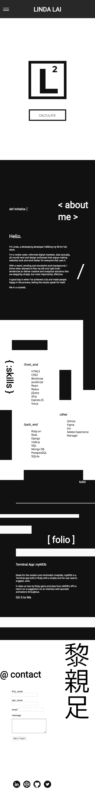

# Coding Portfolio - Linda Lai
Designed and developed by Linda Lai in HTML & CSS.

## Portfolio Links
* URL: https://ladnil.github.io/
* GitHub: https://github.com/ladnil/ladnil.github.io
* Figma: https://www.figma.com/file/WYyBs8vJ01FDA6ublEDyBPbO/Portfolio?node-id=0%3A1


## Description
This portfolio was designed, coded and deployed over the course of a week, and is the first iteration of my personal website. In its current iteration, the website is stable, responsive and nicely designed with some minor animations, with further enhancements and optimisations planned for future iterations.

### Purpose
Tasked with designing and developing a personal portfolio website in pure HTML and CSS over the course of a week, https://ladnil.github.io/ was born. As an aspiring full-stack developer, understanding my preferences and influences from a design and development perspective is essential not only towards developing my own personal brand but also articulating that to any potential clients or employers through my projects and digital channels. As such, this portfolio website showcases and summarises my approach to developement and design: the simple and basics done right, 
but effective 

### Functionality
I designed my portfolio to be as responsive and accessible as possible while learning the ropes of CSS as a beginner.  As an aspiring developer that also extremely design-driven, I wanted this to be reflected in the end product and to challenge myself, but also to plan and execute a design I could realistically achieve in the timeframe.

My portfolio website has be designed mobile-first but is also compatable with desktops and all current browsers using CSS grid. With a single-page scroll and a responsive navigation bar which transitions from a menu bar to a hamburger menu, users can navigate to each section via scroll or via anchor links from the menu. The overall theme is deliberately minimalist, typographic and monochrome, using abstract shapes and lines to fill space, and features some clickable and hoverable animations and transitions for users that provide splashes of colour rendered in bright primary blue, red and yellow.

### Sitemap
As a single page scroll, my portfolio website is broken up into sections, navigable from the menu bar or by scrolling:
* Home: landing page featuring my logo.
* About: short biography.
* Skills: tech stack summary.
* Folio: links to GitHub repos.
* Contact: form to contact me via Formspree.

### Screenshots
Desktop:


Mobile:



### Target Audience

### Tech Stack


* Description of your portfolio website, including,
    * Purpose
    * Functionality / features
    * Sitemap
    * Screenshots
    * Target audience
    * Tech stack (e.g. html, css, deployment platform, etc)
```
```

## Design Documentation
* Design documentation including,
    * Design process
    * Wireframes
    * Personal logo (optional)
    * Usability considerations
```
```

## Design Ideation and Planning
* Details of planning process including,
    * Project plan & timeline
    * Screenshots of Trello board(s)
```
```
* Short Answer Q&A - Include short answers to the following questions
    * Describe key events in the development of the internet from the 1980s to today (max. 150 words)
    * Define and describes the relationship between fundamental aspects of the internet such as: domains, web servers, DNS, and web browsers (max. 150 words)
    * Reflect on one aspect of the development of internet technologies and how it has contributed to the world today (max. 150 words)
```
```

### Resources
* All files linked by the README.md file must be included in a folder named docs.
* All resources included in this folder must be in either png, jpeg, pdf, or markdown format

### Source Code
* Source code for your entire website.

### Presentation
* Slide Deck for Presentation in PDF format.
